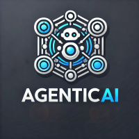

# Agentic AI

> A comprehensive knowledge hub for Agentic AI—your gateway to the future of autonomous AI systems.

## 🌟 Overview

A curated knowledge hub on Agentic AI, featuring the best projects, research, and resources. This repository currently spans 24 specialized domains—from Healthcare, Vision, and Software Engineering to Security, Robotics, Ethics & Safety, and more. Each domain page links to focused posts and references that highlight practical agentic techniques, frameworks, and real-world applications.

## 📚 Research Fields

Browse our collection by research domain:

| Domain | Domain | Domain | Domain |
|--------|--------|--------|--------|
| [💊 Healthcare](README-healthcare.md) | [🛡️ Security](README-security.md) | [🔬 Research](README-research.md) | [🎓 Education](README-education.md) |
| [👁️ Vision](README-vision.md) | [💻 Software Engineering](README-software-engineering.md) | [🎮 Gaming](README-gaming.md) | [📦 Supply Chain](README-supply-chain.md) |
| [🤖 Foundation Models](README-foundation-models.md) | [📐 Design](README-design.md) | [🧪 Testing](README-testing.md) | [🏭 OT/IoT](README-iot.md) |
| [🤖 Robotics](README-robotics.md) | [⚡ Automation](README-automation.md) | [⚙️ Framework](README-framework.md) | [📋 Planning](README-planning.md) |
| [🎯 Recommendation](README-recommendation.md) | [🌆 Smart Cities](README-smart-cities.md) | [🔧 Hardware Design](README-hardware-design.md) | [⛓️ Blockchain](README-blockchain.md) |
| [📡 Networking](README-networking.md) | [🚦 Transportation](README-transportation.md) | [⚖️ Ethics and Safety](README-ethics-and-safety.md) | [🧠 Reasoning](README-reasoning.md) |

## 🤝 Contributing

We welcome contributions! Whether you have:
- New resources to add
- Updates to existing content
- Suggestions for improvements
- Bug reports

Please feel free to:
1. Open an issue
2. Submit a pull request
3. Start a discussion

Together, we can keep this knowledge hub comprehensive and current.

## 👤 Author

**Mahmoud Rabie**
- [LinkedIn Profile](https://www.linkedin.com/in/mahmoudrabie2004/)
- [GitHub Profile](https://github.com/mahmoudrabie)
- [X Profile](https://x.com/MahRabie)

---
