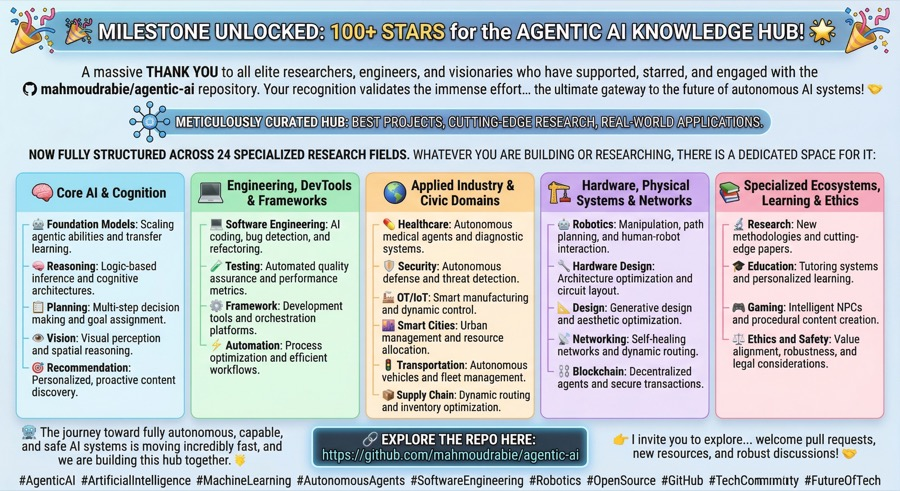

# Agentic AI Research Radar

**300+ curated agentic AI papers, benchmarks, frameworks, and real-world systems across 24 domains.**

[Start with Frameworks](README-framework.md) | [Explore Security](README-security.md) | [Browse Research](README-research.md) | [Contribute a Resource](CONTRIBUTING.md)

## Why This Repo

Agentic AI moves fast, and useful work is scattered across papers, code repositories, benchmark releases, technical posts, and domain-specific case studies. This repo tracks high-signal work in one place so builders and researchers can quickly find:

- frameworks and orchestration patterns for building agents
- evaluation, testing, and benchmark resources
- security, safety, and governance research
- domain applications in healthcare, robotics, software engineering, IoT, education, and more

If this saves you research time, starring the repo helps more builders discover it.

## Suggested Paths

| Path | Follow these domains |
| --- | --- |
| Core AI & Cognition | [Foundation Models](README-foundation-models.md), [Reasoning](README-reasoning.md), [Planning](README-planning.md), [Vision](README-vision.md), [Recommendation](README-recommendation.md) |
| Engineering, DevTools & Frameworks | [Software Engineering](README-software-engineering.md), [Testing](README-testing.md), [Framework](README-framework.md), [Automation](README-automation.md) |
| Applied Industry & Civic Domains | [Healthcare](README-healthcare.md), [Security](README-security.md), [OT/IoT](README-iot.md), [Smart Cities](README-smart-cities.md), [Transportation](README-transportation.md), [Supply Chain](README-supply-chain.md) |
| Hardware, Physical Systems & Networks | [Robotics](README-robotics.md), [Hardware Design](README-hardware-design.md), [Design](README-design.md), [Networking](README-networking.md), [Blockchain](README-blockchain.md) |
| Specialized Ecosystems, Learning & Ethics | [Research](README-research.md), [Education](README-education.md), [Gaming](README-gaming.md), [Ethics and Safety](README-ethics-and-safety.md) |

## Domain Index

| Domain | Resources | Focus |
| --- | ---: | --- |
| [Research](README-research.md) | 61 | AI scientists, deep research, autonomous discovery |
| [Framework](README-framework.md) | 54 | Agent runtimes, memory, tools, orchestration |
| [Security](README-security.md) | 49 | Prompt injection, red teaming, cyber agents, defenses |
| [Reasoning](README-reasoning.md) | 20 | Inference, deliberation, cognitive architectures |
| [Testing](README-testing.md) | 18 | Benchmarks, harnesses, evaluation methodology |
| [Automation](README-automation.md) | 14 | Process automation and workflow optimization |
| [Healthcare](README-healthcare.md) | 15 | Medical agents, diagnosis, pharma, biomedical research |
| [Software Engineering](README-software-engineering.md) | 15 | Coding agents, debugging, refactoring, code review |
| [Networking](README-networking.md) | 9 | Self-healing networks and routing |
| [Vision](README-vision.md) | 6 | Visual agents and multimodal grounding |
| [Foundation Models](README-foundation-models.md) | 5 | Agentic capabilities in foundation models |
| [Ethics and Safety](README-ethics-and-safety.md) | 5 | Alignment, fairness, trust, governance |
| [Hardware Design](README-hardware-design.md) | 5 | EDA, chip design, verification |
| [OT/IoT](README-iot.md) | 5 | Industrial systems and device control |
| [Recommendation](README-recommendation.md) | 5 | Personalization and proactive discovery |
| [Smart Cities](README-smart-cities.md) | 5 | Urban operations and civic systems |
| [Blockchain](README-blockchain.md) | 4 | Decentralized agents and secure transactions |
| [Gaming](README-gaming.md) | 4 | NPCs, simulation, procedural content |
| [Transportation](README-transportation.md) | 3 | Autonomous vehicles and fleet management |
| [Design](README-design.md) | 2 | Generative and collaborative design |
| [Planning](README-planning.md) | 2 | Multi-step decision making and goal assignment |
| [Education](README-education.md) | 1 | Tutoring and personalized learning |
| [Robotics](README-robotics.md) | 1 | Embodied agents and physical systems |
| [Supply Chain](README-supply-chain.md) | 1 | Routing, inventory, logistics optimization |

## Curation Standard

The repo is moving toward GitHub-native, canonical resource links:

- Primary links should point to the paper, code repository, benchmark, docs, or project page.
- LinkedIn/X posts are useful as commentary, but should be secondary links.
- Titles should be plain readable text.
- Resources should be placed in the most relevant domain and avoid duplicates.

See [CONTRIBUTING.md](CONTRIBUTING.md) for the full contribution checklist.
See [CURATION.md](CURATION.md) for the detailed resource quality bar and link-priority rules.

## Contribution Priorities

The highest-impact contributions right now are:

- Add canonical paper/code/project links for existing LinkedIn-only entries.
- Expand thin domains: Education, Robotics, Supply Chain, Planning, Design, Blockchain, and Transportation.
- Add short summaries and tags for high-impact resources.
- Report broken links, duplicates, or stale entries.

## Author

**Mahmoud Rabie**

- [LinkedIn](https://www.linkedin.com/in/mahmoudrabie2004/)
- [GitHub](https://github.com/mahmoudrabie)
- [X](https://x.com/MahRabie)
