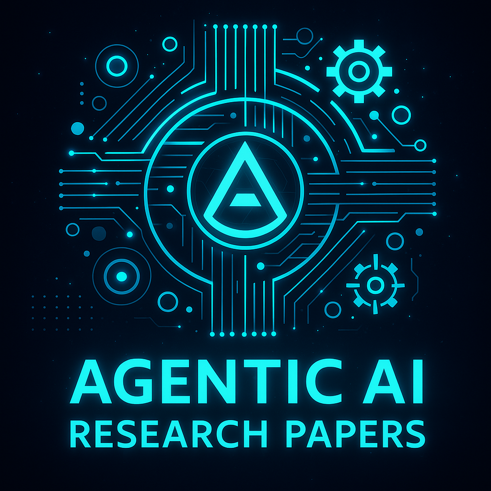

> A comprehensive knowledge hub for Agentic AI—your gateway to the future of autonomous AI systems.

## 🌟 Overview

Agentic AI represents the next frontier in artificial intelligence, where systems can autonomously plan, decide, and execute actions to achieve complex goals with minimal human intervention. This repository serves as your curated guide through the rapidly evolving landscape of autonomous AI systems.

## 📚 Table of Contents

- [Open-Source Projects](#open-source-projects) 🛠️
- [Research Papers](#research-papers) 📄
- [LLM Models](#llm-models) 🤖
- [Professional Tools](#professional-tools) 💼
- [Frameworks](#frameworks) ⚙️
- [Books](#books) 📖
- [Articles](#articles) 📰
- [LinkedIn Posts](#linkedin-posts) 🔗

## 🗂️ Repository Structure

### Open-Source Projects
| Library | Description | Link |
|---------|-------------|------|
| Auto-GPT | An experimental open-source attempt to make GPT-4 fully autonomous | [Link](https://github.com/Significant-Gravitas/Auto-GPT) |
| BabyAGI | An AI-powered task management system | [Link](https://github.com/yoheinakajima/babyagi) |
| AgentGPT | Assemble, configure, and deploy autonomous AI Agents | [Link](https://github.com/reworkd/AgentGPT) |
| SuperAGI | A dev-first open source autonomous AI agent framework | [Link](https://github.com/TransformerOptimus/SuperAGI) |
| OpenAGI | An open-source AGI research platform | [Link](https://github.com/agiresearch/OpenAGI) |
| MetaGPT | The Multi-Agent Framework | [Link](https://github.com/geekan/MetaGPT) |
| MiniAGI | A minimal general-purpose autonomous agent | [Link](https://github.com/muellerberndt/mini-agi) |
| GPT Engineer | Specify what you want it to build, the AI asks for clarification, and then builds it | [Link](https://github.com/gpt-engineer-org/gpt-engineer) |
| AutoGen | Enable Next-Gen Large Language Model Applications | [Link](https://github.com/microsoft/autogen) |

### Research Papers
| Edition | Research |
|---------|----------|
| [6th](https://www.linkedin.com/pulse/agentic-ai-insights-edition-6-march-week-3-2025-mahmoud-rabie-obuuf/?trackingId=YVhAHjBTQu2G74PJ0bO4Ig%3D%3D) | 🤖🩺✂🪡 SurgRAW: Multi-Agent Workflow with Chain-of-Thought Reasoning for Surgical Intelligence |
| [6th](https://www.linkedin.com/pulse/agentic-ai-insights-edition-6-march-week-3-2025-mahmoud-rabie-obuuf/?trackingId=YVhAHjBTQu2G74PJ0bO4Ig%3D%3D) | 🤖🩺 Multi-Agent Cognitive Intelligence for Non-Linear Mental Health Detection |
| [6th](https://www.linkedin.com/pulse/agentic-ai-insights-edition-6-march-week-3-2025-mahmoud-rabie-obuuf/?trackingId=YVhAHjBTQu2G74PJ0bO4Ig%3D%3D) | 🤖♟️ SPIN-Bench: Testing LLMs in Strategic Planning and Social Reasoning |
| [6th](https://www.linkedin.com/pulse/agentic-ai-insights-edition-6-march-week-3-2025-mahmoud-rabie-obuuf/?trackingId=YVhAHjBTQu2G74PJ0bO4Ig%3D%3D) | 🤖💊 TXAGENT: Evidence-Grounded AI for Precision Therapeutics |
| [6th](https://www.linkedin.com/pulse/agentic-ai-insights-edition-6-march-week-3-2025-mahmoud-rabie-obuuf/?trackingId=YVhAHjBTQu2G74PJ0bO4Ig%3D%3D) | 🤖🔍 ReasonGraph: Visualizing and Analyzing LLM Reasoning Paths |
| [6th](https://www.linkedin.com/pulse/agentic-ai-insights-edition-6-march-week-3-2025-mahmoud-rabie-obuuf/?trackingId=YVhAHjBTQu2G74PJ0bO4Ig%3D%3D) | 🤖🎨 CoSTA*: Cost-Sensitive Toolpath Agent for Multi-turn Image Editing |
| [6th](https://www.linkedin.com/pulse/agentic-ai-insights-edition-6-march-week-3-2025-mahmoud-rabie-obuuf/?trackingId=YVhAHjBTQu2G74PJ0bO4Ig%3D%3D) | 🤖🩻 GEMA-Score: Granular Explainable Multi-Agent Score for Radiology Report Evaluation |
| [6th](https://www.linkedin.com/pulse/agentic-ai-insights-edition-6-march-week-3-2025-mahmoud-rabie-obuuf/?trackingId=YVhAHjBTQu2G74PJ0bO4Ig%3D%3D) | 🤖💻 SETUPAGENT: Automating Benchmark Generation for Code Agents |
| [6th](https://www.linkedin.com/pulse/agentic-ai-insights-edition-6-march-week-3-2025-mahmoud-rabie-obuuf/?trackingId=YVhAHjBTQu2G74PJ0bO4Ig%3D%3D) | 🤖🎮 VLM-Attention: Human-Aligned AI for StarCraft II |
| [6th](https://www.linkedin.com/pulse/agentic-ai-insights-edition-6-march-week-3-2025-mahmoud-rabie-obuuf/?trackingId=YVhAHjBTQu2G74PJ0bO4Ig%3D%3D) | 🤖🧠 Sketch-of-Thought: Efficient LLM Reasoning with Cognitive-Inspired Sketching |
| [6th](https://www.linkedin.com/pulse/agentic-ai-insights-edition-6-march-week-3-2025-mahmoud-rabie-obuuf/?trackingId=YVhAHjBTQu2G74PJ0bO4Ig%3D%3D) | 🤖🩺 Multi-Agent Healthcare Assistant: Edge-Device AI for Privacy-Focused Health Management |
| [6th](https://www.linkedin.com/pulse/agentic-ai-insights-edition-6-march-week-3-2025-mahmoud-rabie-obuuf/?trackingId=YVhAHjBTQu2G74PJ0bO4Ig%3D%3D) | 🤖📦 SustAI-SCM: Agentic AI for Sustainable Supply Chain Automation |
| [6th](https://www.linkedin.com/pulse/agentic-ai-insights-edition-6-march-week-3-2025-mahmoud-rabie-obuuf/?trackingId=YVhAHjBTQu2G74PJ0bO4Ig%3D%3D) | 🤖🧠 Society of HiveMind: Multi-Agent Optimization of Foundation Model Swarms |
| [6th](https://www.linkedin.com/pulse/agentic-ai-insights-edition-6-march-week-3-2025-mahmoud-rabie-obuuf/?trackingId=YVhAHjBTQu2G74PJ0bO4Ig%3D%3D) | 🤖🧠 SYMBOLIC-MOE: Adaptive Skill-based Routing for Heterogeneous Reasoning |
| [6th](https://www.linkedin.com/pulse/agentic-ai-insights-edition-6-march-week-3-2025-mahmoud-rabie-obuuf/?trackingId=YVhAHjBTQu2G74PJ0bO4Ig%3D%3D) | 🤖📐 From Idea to CAD: A Language Model-Driven Multi-Agent System for Collaborative Design |
| [6th](https://www.linkedin.com/pulse/agentic-ai-insights-edition-6-march-week-3-2025-mahmoud-rabie-obuuf/?trackingId=YVhAHjBTQu2G74PJ0bO4Ig%3D%3D) | 🤖🛠 ToolFuzz: Automated Agent Tool Testing |
| [6th](https://www.linkedin.com/pulse/agentic-ai-insights-edition-6-march-week-3-2025-mahmoud-rabie-obuuf/?trackingId=YVhAHjBTQu2G74PJ0bO4Ig%3D%3D) | 🤖🩺 MedR-Bench: Quantifying The Reasoning Abilities of LLMs on Real-world Clinical Cases |
| [6th](https://www.linkedin.com/pulse/agentic-ai-insights-edition-6-march-week-3-2025-mahmoud-rabie-obuuf/?trackingId=YVhAHjBTQu2G74PJ0bO4Ig%3D%3D) | 🤖🔍 MAS-LSTM: A Multi-Agent LSTM-Based Approach for Scalable Anomaly Detection in IIoT Networks |
| [6th](https://www.linkedin.com/pulse/agentic-ai-insights-edition-6-march-week-3-2025-mahmoud-rabie-obuuf/?trackingId=YVhAHjBTQu2G74PJ0bO4Ig%3D%3D) | 🤖🧬 DrBioRight 2.0: An LLM-powered Chatbot for Cancer Functional Proteomics |
| [5th](https://www.linkedin.com/newsletters/agentic-ai-insights-7271573588309127168/) | 🤖🚁 MARVEL: Multi-Agent Reinforcement Learning for Constrained Field-of-View Multi-Robot Exploration |
| [5th](https://www.linkedin.com/newsletters/agentic-ai-insights-7271573588309127168/) | 🤖🧠 System 1 to System 2: A Survey of Reasoning Large Language Models |
| [5th](https://www.linkedin.com/newsletters/agentic-ai-insights-7271573588309127168/) | 🤖🩺 M3Builder: A Multi-Agent System for Automated Machine Learning in Medical Imaging |
| [5th](https://www.linkedin.com/newsletters/agentic-ai-insights-7271573588309127168/) | 🤖🧠 FAST: Visual Agents As Fast and Slow Thinkers |
| [5th](https://www.linkedin.com/newsletters/agentic-ai-insights-7271573588309127168/) | 🤖🏆 Agentic Reward Modeling: Integrating Human Preferences with Verifiable Correctness Signals |
| [5th](https://www.linkedin.com/newsletters/agentic-ai-insights-7271573588309127168/) | 🤖📊 METAL: A Multi-Agent Framework for Chart Generation with Test-Time Scaling |
| [5th](https://www.linkedin.com/newsletters/agentic-ai-insights-7271573588309127168/) | 🤖🧠 LLM Post-Training: A Deep Dive into Reasoning Large Language Models |
| [5th](https://www.linkedin.com/newsletters/agentic-ai-insights-7271573588309127168/) | 🤖🚀 AutoAgent: A Fully-Automated and Zero-Code Framework for LLM Agents |
| [5th](https://www.linkedin.com/newsletters/agentic-ai-insights-7271573588309127168/) | 🤖🧠 Tree-of-Debate: Multi-Person Debate Trees Elicit Critical Thinking for Scientific Comparative Analysis |
| [5th](https://www.linkedin.com/newsletters/agentic-ai-insights-7271573588309127168/) | 🤖🛠️ PlanGEN: A Multi-Agent Framework for Generating Planning and Reasoning Trajectories |
| [5th](https://www.linkedin.com/newsletters/agentic-ai-insights-7271573588309127168/) | 🤖🔍 MACRec: A Multi-Agent Collaboration Framework for Recommendation |
| [5th](https://www.linkedin.com/newsletters/agentic-ai-insights-7271573588309127168/) | 🤖🔗 TAG: A Decentralized Framework for Multi-Agent Hierarchical Reinforcement Learning |
| [5th](https://www.linkedin.com/newsletters/agentic-ai-insights-7271573588309127168/) | 🤖🧠 MASTER: A Multi-Agent System with LLM-Specialized MCTS |
| [5th](https://www.linkedin.com/newsletters/agentic-ai-insights-7271573588309127168/) | 🤖💬 Talk Structurally, Act Hierarchically: A Collaborative Framework for LLM Multi-Agent Systems |
| [5th](https://www.linkedin.com/newsletters/agentic-ai-insights-7271573588309127168/) | 🤖🔩 Marco: Configurable Graph-Based Task Solving and Multi-AI Agents Framework for Hardware Design |
| [5th](https://www.linkedin.com/newsletters/agentic-ai-insights-7271573588309127168/) | 🤖💻 PC-Agent: Hierarchical Multi-Agent Collaboration for Complex Task Automation |
| [5th](https://www.linkedin.com/newsletters/agentic-ai-insights-7271573588309127168/) | 🤖🔧 OctoTools: Agentic Framework for Complex Reasoning |

### LLM Models
Key language models powering agentic AI:
- GPT-4
- GPT-3.5 Turbo
- LLaMA 2
- Claude 2
- And other emerging models

### Professional Tools
Enterprise-grade solutions for agentic AI development:
- OpenAI's function calling
- Orchestration platforms
- AI productivity assistants
- Industry-standard tools

### Frameworks
Essential development frameworks:
- LangChain
- LlamaIndex
- AutoGen
- Haystack
- SuperAGI

### Books
Curated collection of influential books covering:
- Technical implementations
- Strategic insights
- Ethical considerations
- Future perspectives

### Articles
Stay updated with:
- Industry insights
- Market analysis
- Expert opinions
- Latest trends

### LinkedIn Posts
Exclusive content from the *Agentic AI Insights* newsletter, featuring:
- Real-world applications
- Industry trends
- Technical deep-dives
- Practical insights

#### 📰 Latest Newsletter Editions
- [Edition 6 – March Week 3, 2025](https://www.linkedin.com/newsletters/agentic-ai-insights-7271573588309127168/)
  - ☁️ Cloud/🦾 AI/🛡️Cybersecurity State-Of-The-Art (SOTA) and latest advancements, Edition 10, March Week 3, 2025
  - 🧠 Open Source LLMs 🧠, Edition 3, March Week 3, 2025

- [Edition 5 – March Week 2, 2025](https://www.linkedin.com/newsletters/agentic-ai-insights-7271573588309127168/)
  - ☁️ Cloud/🦾 AI/🛡️Cybersecurity State-Of-The-Art (SOTA) and latest advancements, Edition 9, March Week 2, 2025
  - 🧠 Open Source LLMs 🧠, Edition 2, March Week 2, 2025

- [Edition 4 – February Week 3, 2025](https://www.linkedin.com/newsletters/agentic-ai-insights-7271573588309127168/)
  - ☁️ Cloud/🦾 AI/🛡️Cybersecurity State-Of-The-Art (SOTA) and latest advancements, Edition 8, February Week 3, 2025
  - 🧠 Open Source LLMs 🧠, Edition 1, February Week 3, 2025

- [Edition 3 – February Week 2, 2025](https://www.linkedin.com/newsletters/agentic-ai-insights-7271573588309127168/)
  - ☁️ Cloud/🦾 AI/🛡️Cybersecurity State-Of-The-Art (SOTA) and latest advancements, Edition 7, February Week 2, 2025

- [Edition 2 – February Week 1, 2025](https://www.linkedin.com/newsletters/agentic-ai-insights-7271573588309127168/)
  - ☁️ Cloud/🦾 AI/🛡️Cybersecurity State-Of-The-Art (SOTA) and latest advancements, Edition 6, February Week 1, 2025

- [Edition 1 – January Week 4, 2025](https://www.linkedin.com/newsletters/agentic-ai-insights-7271573588309127168/)
  - ☁️ Cloud/🦾 AI/🛡️Cybersecurity State-Of-The-Art (SOTA) and latest advancements, Edition 5, January Week 4, 2025

## 🤝 Contributing

We welcome contributions! Whether you have:
- New resources to add
- Updates to existing content
- Suggestions for improvements
- Bug reports

Please feel free to:
1. Open an issue
2. Submit a pull request
3. Start a discussion

Together, we can keep this knowledge hub comprehensive and current.

## 📄 License

This project is licensed under the [MIT License](LICENSE) - see the LICENSE file for details.

## 👤 Author

**Mahmoud Rabie**
- [LinkedIn Profile](https://www.linkedin.com/in/mahmoudrabie2004/)
- [GitHub Profile](https://github.com/mahmoudrabie)

---
⭐️ If you find this repository helpful, please consider giving it a star!

